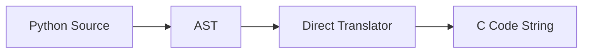
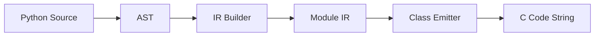
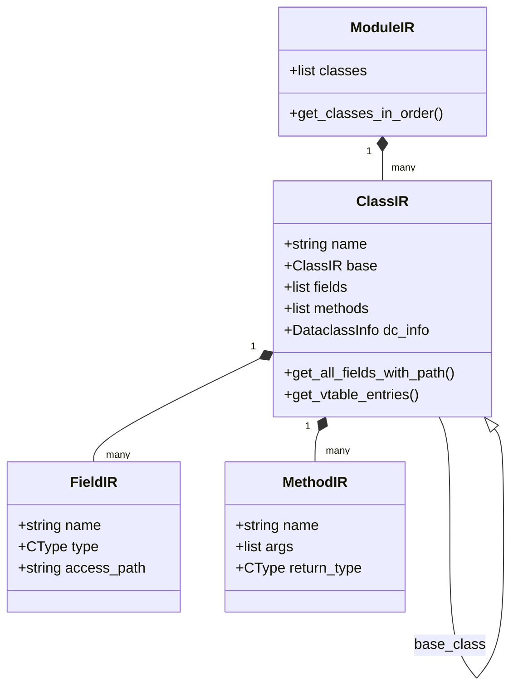

# Why IR Matters: Compiling Python Classes to C

*Moving beyond direct AST translation for complex type systems in MicroPython.*

---

What happens when you try to compile Python classes to C for an embedded device?

If you are building a compiler for a high-level language like Python, the first few days are intoxicating. You start with basic arithmetic, then move to function calls. You walk the Abstract Syntax Tree (AST), emit some C strings, and suddenly your `def add(a: int, b: int) -> int: return a + b` is running as a native C function on an ESP32. It feels like magic. The path from Python to machine code seems like a straight line, and you start to wonder why anyone ever said compiler writing was hard.

But then you hit the wall. You try to compile a class hierarchy with inheritance, method overrides, and dataclass-style field initialization. Suddenly, "walking the tree and spitting out strings" isn't enough. You realize that to generate correct C code for a class, you need to know things that aren't visible in the local AST node you are currently visiting. You need a global view of the world—a model that spans across file boundaries and inheritance chains.

In this post, we’ll explore the evolution of the `mypyc-micropython` compiler: how we started with a direct AST-to-C approach, why it worked for simple data structures, and how introducing an Intermediate Representation (IR) was the only way to conquer Python classes.

## Background: Python to C for the Smallest Systems

The `mypyc-micropython` project aims to bridge the gap between Python’s developer velocity and C’s execution performance on microcontrollers. We take typed Python code and compile it into MicroPython C user modules. These modules can then be baked into the MicroPython firmware, providing a significant speed boost for performance-critical logic on hardware like the ESP32.

Our project targets the MicroPython runtime, which already provides a rich set of C APIs for managing objects, memory, and types. However, writing these modules by hand is tedious and error-prone. You have to manually manage object boxing, function registration, and type descriptors. Our compiler automates this by translating typed Python source into C code that implements the MicroPython object model.

Initially, this translation was a single-pass journey. We thought we could just keep adding more visitors to our AST walker. We were wrong. As we moved from functions to classes, the complexity didn't just grow—it changed shape.

## The Direct Approach: AST → C

When we started, our compiler followed a straightforward "Direct Translation" pattern. We implemented a `TypedPythonTranslator` that would visit AST nodes and immediately return or emit C code.

For simple data structures like lists and dictionaries, this worked surprisingly well. The reason is that these types are "opaque" to the compiler—their memory layout is managed by MicroPython's core, and we only need to know how to call the right API functions.

### Compiling Lists: The Temp Queue and Boxing

In Python, a list literal can appear anywhere: as a function argument, inside another list, or as part of a return statement. In C, however, initializing a list often requires multiple lines of code. Furthermore, because MicroPython lists can hold any object, we have to "box" our raw C types (like `int` or `float`) into MicroPython objects (`mp_obj_t`).

Our `_translate_list` method handled this by using a "deferred initialization" strategy. When we see `[x, y]`, we don't know the exact C context yet, so we generate a temporary variable name and store the "recipe" for creating the list.

```python
def _translate_list(self, node: ast.List) -> str:
    # 1. Generate a name like 'list_tmp1'
    temp_name = self._fresh_temp("list")
    
    # 2. Translate elements (recursively calling into our walker)
    # This handles nested lists: [[1], [2]]
    elements = []
    for elt in node.elts:
        c_expr = self._translate_expr(elt)
        # We must ensure the element is boxed as a MicroPython object
        boxed_expr = self._box_if_needed(c_expr, elt.annotation)
        elements.append(boxed_expr)
    
    # 3. Store the list initialization in a queue to be emitted at 
    # the start of the current C block or statement boundary.
    self._pending_list_temps.append((temp_name, elements))
    
    return temp_name
```

To make this work, we had to implement `_flush_pending_list_temps`, which would emit the actual C code at the right moment (e.g., before the `return` statement that uses the list). This ensured that even if a list was defined deep inside a nested expression, its C initialization happened in a valid scope.

```c
// Emitted during flush
mp_obj_t list_tmp1 = mp_obj_new_list(0, NULL);
mp_obj_list_append(list_tmp1, mp_obj_new_int(1));
mp_obj_list_append(list_tmp1, mp_obj_new_int(2));
// Now list_tmp1 can be safely used in an expression
```

### The Giant If-Else: Method Calls as API Mapping

For method calls like `my_list.append(x)`, we didn't need to look up a vtable or understand a class structure. We just needed to know that `my_list` was a list. We implemented a giant if-else chain in `_translate_method_call_expr` that mapped Python methods to MicroPython C calls.

```python
def _translate_method_call_expr(self, node: ast.Call) -> str:
    # ... logic to identify the object and method ...
    if obj_type == "list":
        if method_name == "append":
            return f"mp_obj_list_append({obj}, {arg})"
        elif method_name == "pop":
            if not node.args:
                return f"mp_obj_list_pop({obj})"
            return f"mp_obj_list_pop_at({obj}, {self._translate_expr(node.args[0])})"
    elif obj_type == "dict":
        if method_name == "get":
            return f"mp_obj_dict_get({obj}, {key})"
    # ... and dozens more methods ...
```

This pattern is simple and effective for built-in types. The compiler doesn't need to know the internal layout of the list or dictionary; it just needs to know the "verbs" (methods) available and how to translate them to C API calls. There is no inheritance, no polymorphism, and no custom struct layout to worry about.

## The Wall: The Problem with Classes

The direct AST-to-C approach breaks down the moment you introduce user-defined classes. Unlike a list, a class’s "shape" (its memory layout and behavior) is defined by the user and can change based on other parts of the program.

There are five major reasons why direct translation fails for classes:

### 1. Struct Layout with Field Offsets
In C, a class is represented by a `struct`. If `Class B` inherits from `Class A`, the C struct for `B` must include all fields from `A`. 

```python
class A:
    x: int

class B(A):
    y: int
```

To generate the struct for `B`, you must have already analyzed `A`. If you are walking the AST and see `class B(A)`, you need to know how many fields `A` has to calculate where `y` should be placed in memory. If `A` is in a different part of the file, a simple one-pass walker won't have that information unless it has built a global map of classes.

### 2. Virtual Method Dispatch (Vtables)
Polymorphism is the heart of object-oriented programming. If `B` overrides a method `f()` from `A`, the vtable (virtual function table) for `B` must point to `B_f`, while the vtable for `A` points to `A_f`.

Computing this vtable requires:
-   Knowing the full inheritance tree.
-   Resolving which method overrides which.
-   Assigning a consistent slot index to each method across the hierarchy so that a `B` object can be used wherever an `A` object is expected.

### 3. Forward Declarations and Topological Sorting
C is strict about order. You cannot reference a struct or a type before it has been defined. In Python, you can define classes in any order. If `Class A` refers to `Class B` and vice-versa, the compiler must be smart.

Consider this case:
```python
class Node:
    parent: "Tree"
    value: int

class Tree:
    root: Node
```

In C, the struct for `Node` needs to know about `Tree`, and `Tree` needs to know about `Node`. Our IR solves this in two ways:
1.  **Forward Declarations**: The `ClassEmitter` first emits `typedef struct _obj_Node_t obj_Node_t;` for every class in the module. This allows structs to contain pointers to other structs that haven't been fully defined yet.
2.  **Topological Sort**: For inheritance, forward declarations aren't enough. A child struct *contains* the parent struct by value, not just by pointer. This means the parent *must* be fully defined before the child. Our `ModuleIR` uses a depth-first search (DFS) to sort classes so that base classes always appear first in the generated C file.

Without a structured IR, implementing this sort would require multiple passes over the AST, making the compiler slow and difficult to maintain. By building a dependency graph in the IR, we can perform the sort in a single, clean operation.

### 4. Dataclass Auto-Generation
Many of our users love `@dataclass`. Compiling a dataclass isn't just about the methods the user wrote; it's about the methods the *compiler* must generate: `__init__`, `__repr__`, `__eq__`, etc. 

This metadata—which fields exist, what their types are, and whether they have default values—needs to be collected in a first pass and then passed to a generator that spits out multiple C functions. Trying to do this while "walking" the AST is like trying to build a house while the architect is still drawing the blueprints.

### 5. Access Paths and Inheritance Chains
Inside a method of `B`, accessing a field `x` inherited from `A` might require a different C access path than a local field. In our implementation, we use nested structs to mirror inheritance:

```c
typedef struct { mp_int_t x; } obj_A_t;
typedef struct { obj_A_t base; mp_int_t y; } obj_B_t;
```

Accessing `x` from a `B` pointer requires `self->base.x`. Accessing `y` requires `self->y`. If `B` inherits from `A` which inherits from `Base`, the path to a field in `Base` might be `self->base.base.field`. The compiler must track this "access path" for every field in the hierarchy.

## Introducing IR: The Two-Phase Solution

To solve these problems, we introduced an **Intermediate Representation (IR)**. Instead of going directly from AST to C, we now have a two-phase pipeline.

### Phase 1: AST to IR (The Builder)
The first phase is the **IR Builder**. It walks the AST but instead of emitting C, it creates a graph of Python objects that represent the program's structure. These objects are defined as dataclasses in our `ir.py` module:

-   **`FieldIR`**: Records the name, type (using our `CType` enum), and the calculated C access path relative to the struct.
-   **`MethodIR`**: Records the name, argument types, return type, and whether it overrides a parent method.
-   **`ClassIR`**: The central node. It holds lists of `FieldIR` and `MethodIR`, a reference to its base `ClassIR`, and metadata like whether it's a dataclass.
-   **`ModuleIR`**: A top-level container that holds all the `ClassIR` nodes for a given compilation unit.

### Phase 2: IR to C (The ClassEmitter)
The second phase is the **ClassEmitter**. It doesn't look at the AST at all. Instead, it iterates over the `ModuleIR` and uses the pre-computed metadata to generate C code.

By the time the `ClassEmitter` starts, the IR has already solved the hard problems:
-   **`ClassIR.get_all_fields_with_path()`**: Recursively traverses the inheritance chain to provide a flat list of all fields and their nested struct paths.
-   **`ClassIR.get_vtable_entries()`**: Merges parent vtables with local overrides to produce the final function pointer array.
-   **`ModuleIR.get_classes_in_order()`**: Performs a topological sort of the classes using a dependency graph.

## Visualizing the Shift

### 1. Direct AST → C Pipeline

*Simple, but limited. It works for functions and built-in types but lacks the context for user-defined types.*

### 2. IR-Based Pipeline

*Robust and extensible. The IR acts as a source of truth that the Emitter can query multiple times.*

### 3. The IR Object Model


## A Concrete Comparison: Point and Point3D

Let's walk through how our IR handles a simple inheritance example.

```python
@dataclass
class Point:
    x: int
    y: int

@dataclass
class Point3D(Point):
    z: int

    def magnitude(self) -> float:
        return (self.x**2 + self.y**2 + self.z**2)**0.5
```

### Phase 1: Building the IR
1.  The IR Builder sees `Point`. It creates a `ClassIR` with two `FieldIR` objects: `x` and `y`.
2.  It sees `Point3D`. It finds the `ClassIR` for `Point` and sets it as the `base`. It adds a local `FieldIR` for `z`.
3.  The IR calculates that `Point3D` actually has three fields. It assigns access paths:
    -   `x` -> `base.x`
    -   `y` -> `base.y`
    -   `z` -> `z` (local)

### Phase 2: Emitting C
The `ClassEmitter` can now generate the structs with perfect precision:

```c
// Struct for Point
typedef struct _obj_Point_t {
    mp_obj_base_t base;
    mp_int_t x;
    mp_int_t y;
} obj_Point_t;

// Struct for Point3D - note the nested 'base' struct
typedef struct _obj_Point3D_t {
    obj_Point_t base; 
    mp_int_t z;
} obj_Point3D_t;
```

Inside the `magnitude` method, when the compiler sees `self.x`, it asks the IR for the access path and generates:

```c
mp_obj_t Point3D_magnitude(mp_obj_t self_in) {
    obj_Point3D_t *self = MP_OBJ_TO_PTR(self_in);
    
    // Paths resolved by IR:
    mp_int_t x = self->base.x; 
    mp_int_t y = self->base.y;
    mp_int_t z = self->z;
    
    double mag = sqrt((double)(x*x + y*y + z*z));
    return mp_obj_new_float(mag);
}
```

Without the IR, the translator would have struggled to know that `self.x` required a `->base.` prefix. It would have had to re-parse or re-scan the `Point` class every time it encountered a subclass, leading to an $O(N^2)$ explosion in complexity and a fragile, buggy implementation.

## Why Not IR for Everything?

If IR is so powerful, why do we still use direct AST translation for arithmetic and built-in types?

The answer is **pragmatic simplicity**. IR adds overhead—both in terms of code volume in the compiler and cognitive load for the developers. For a simple `a + b` expression, the AST already contains 100% of the information needed to generate the C code. There are no cross-entity dependencies.

However, we are reaching the limits of this "hybrid" approach. As we look toward the future, we plan to move more constructs into the IR:

1.  **Type-based Dispatch for Lists**: If the IR knows a list only contains `int`s, we can bypass the expensive MicroPython boxing and use a raw C array internally.
2.  **Optimized Dictionary Lookups**: For dictionaries with string keys known at compile time, we can pre-compute hashes and use a more efficient lookup.
3.  **Exception Handling**: Translating Python `try/except` to C `NLR` (Non-Local Return) blocks requires a structured view of the code that IR is perfect for.

Moving these to IR will allow us to perform **transformation passes**—optimization steps that rewrite the IR to be more efficient before the C code is even generated.

## The C Side: Type Descriptors and Attr Handlers

One of the hidden complexities of compiling Python classes to MicroPython C is the amount of "glue" code required. It's not just about the struct and the methods; it's about telling MicroPython how to interact with that struct.

The `ClassEmitter` uses the IR to generate several key MicroPython objects:

### 1. The Attr Get/Set Handler
To support `obj.x = 10` in Python, we need a C function that can dispatch attribute access. Our IR provides a list of `FieldIR` objects, which we use to generate a `switch` statement that handles type-safe assignment:

```c
static void obj_Point_attr(mp_obj_t self_in, qstr attr, mp_obj_t *dest) {
    obj_Point_t *self = MP_OBJ_TO_PTR(self_in);
    if (dest[0] == MP_OBJ_NULL) {
        // Load attribute
        if (attr == MP_QSTR_x) dest[0] = mp_obj_new_int(self->x);
        else if (attr == MP_QSTR_y) dest[0] = mp_obj_new_int(self->y);
    } else if (dest[1] != MP_OBJ_NULL) {
        // Store attribute
        if (attr == MP_QSTR_x) self->x = mp_obj_get_int(dest[1]);
        else if (attr == MP_QSTR_y) self->y = mp_obj_get_int(dest[1]);
        dest[0] = MP_OBJ_NULL; // Success
    }
}
```

### 2. The Type Definition Object
Finally, we must register the class with MicroPython using the `mp_obj_type_t` struct. This object links the vtable, the attribute handler, and the class name together:

```c
const mp_obj_type_t obj_Point_type = {
    { &mp_type_type },
    .name = MP_QSTR_Point,
    .print = obj_Point_print,
    .make_new = obj_Point_make_new,
    .attr = obj_Point_attr,
    .locals_dict = (mp_obj_dict_t*)&obj_Point_locals_dict,
};
```

All of these fields—the name, the print handler, the constructor—are derived directly from the `ClassIR`. Without the IR, we would be passing around dozen-tuple arguments between functions in our translator. With IR, we just pass a single `ClassIR` pointer.

## Lessons from mypyc

Our design was heavily influenced by the "real" `mypyc` project (the one used to compile `mypy` itself). While our version is specialized for the constraints of MicroPython and ESP32, we adopted several core philosophies:

*   **RTypes (Runtime Types)**: `mypyc` doesn't just use Python types; it uses "Runtime Types" that handle type erasure. It knows when a Python `int` can be a raw C `int64_t` and when it must be a boxed `PyObject*`. We use a similar `CType` enum to decide whether to use `mp_int_t` (for performance) or `mp_obj_t` (for flexibility).
*   **Basic Block Analysis**: In a more advanced compiler, the IR would be broken down into "Basic Blocks"—sequences of instructions with no jumps. This allows for data-flow analysis to detect things like "uninitialized variables" or "dead code" before generating C. While we don't do this yet, our IR is structured to support the addition of a Control Flow Graph (CFG) in the future.
*   **Vtable Layouts and Traits**: `mypyc` handles multiple inheritance by computing complex vtable layouts, often involving "trait vtables" for interface-like behavior. We learned that the "right" way to do this is to keep the vtable structure separate from the class definition, allowing for more flexible dispatch logic.
*   **Refcount Insertion**: Although MicroPython uses Garbage Collection (GC) rather than reference counting, the `mypyc` approach to "glue code" insertion taught us how to automatically insert MicroPython-specific GC hooks and exception handling (`NLR` blocks) by traversing the IR.

By standing on the shoulders of `mypyc`, we were able to skip many of the pitfalls that usually plague new compilers. We realized that even if we are targeting a much smaller runtime, the fundamental problems of type resolution and layout remain the same.

## Future Directions: Extending IR to Data Structures

Our success with classes has convinced us that IR is the way forward for the entire compiler. Our roadmap includes moving our list and dictionary logic out of the "direct translation" phase and into the IR.

Why? Because even simple data structures can benefit from multi-pass analysis. If we know that a list literal is only ever used as a fixed-size array, we can optimize its storage. If we know a dictionary's keys are fixed, we can generate a C `struct` to represent it, providing O(1) field access instead of a hash table lookup.

The IR provides the "intelligence" that turns a simple translator into a true optimizing compiler.

## Conclusion

Intermediate Representation is not an academic luxury; it is a practical necessity when building a compiler that handles modern language features like classes and inheritance. By moving away from "string-spitting" AST walkers and toward a structured IR, we were able to support complex Python hierarchies on the ESP32 with confidence.

The shift to IR has made our compiler more robust, faster, and easier to extend. It proved that sometimes, adding an extra step to your pipeline is actually the fastest way to get to your destination. We've conquered classes; next, we're taking on exceptions and generators, and we know our IR will be there to guide us.

### The Core Challenge: Cross-Entity Analysis

Most simple compiler tasks are "local"—you can understand an `if` statement or a `for` loop just by looking at its children in the AST. But classes introduce "non-local" or "cross-entity" dependencies. 

When you see `self.x` inside a method, you can't know what it means until you've looked at:
1.  The definition of the current class.
2.  The definition of all parent classes.
3.  Any decorators (like `@dataclass`) that might have changed how fields are handled.

This is why a single-pass AST walker feels like it's "hitting a wall." You find yourself wanting to look "sideways" in the tree, or "up" to a previously visited node. The IR is the memory that allows the compiler to perform this cross-entity analysis. It transforms the hierarchical tree into a semantic graph where relationships are explicit and easy to follow.

By separating the "discovery" phase (building the IR) from the "production" phase (emitting C), we give the compiler a chance to "think" about the whole module before it starts writing code. This leads to cleaner C, fewer bugs, and a much more powerful language.

## Debugging with IR: A Developer's Best Friend

One unexpected benefit of moving to an IR-based architecture was how much easier it became to debug the compiler itself. 

In the old AST-to-C world, when the generated C code wouldn't compile, we had to dig through thousands of lines of string-concatenation logic to find out where the mistake happened. Was it in the `_translate_expr` call? Or was it in the boilerplate generator?

With IR, we have a clear checkpoint. We can print the state of the `ModuleIR` before the `ClassEmitter` even runs. We can ask questions like:
- "Does the IR think `Point3D` inherits from `Point`?"
- "What access path was assigned to field `y`?"
- "Are the vtable slots in the right order?"

If the IR is correct but the C is wrong, the bug is in the `ClassEmitter`. If the IR is wrong, the bug is in the `IR Builder`. This separation of concerns has reduced our debugging time significantly and allowed us to add new features with much higher confidence. It turns out that a more complex architecture can actually be simpler to maintain if it matches the mental model of the problem you're trying to solve.

---
*Interested in the implementation? You can find the IR definitions in `src/mypyc_micropython/ir.py` and the generation logic in `src/mypyc_micropython/class_emitter.py`.*
