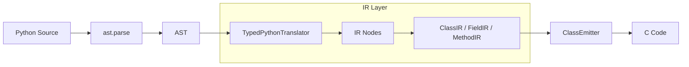
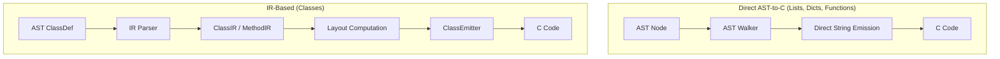
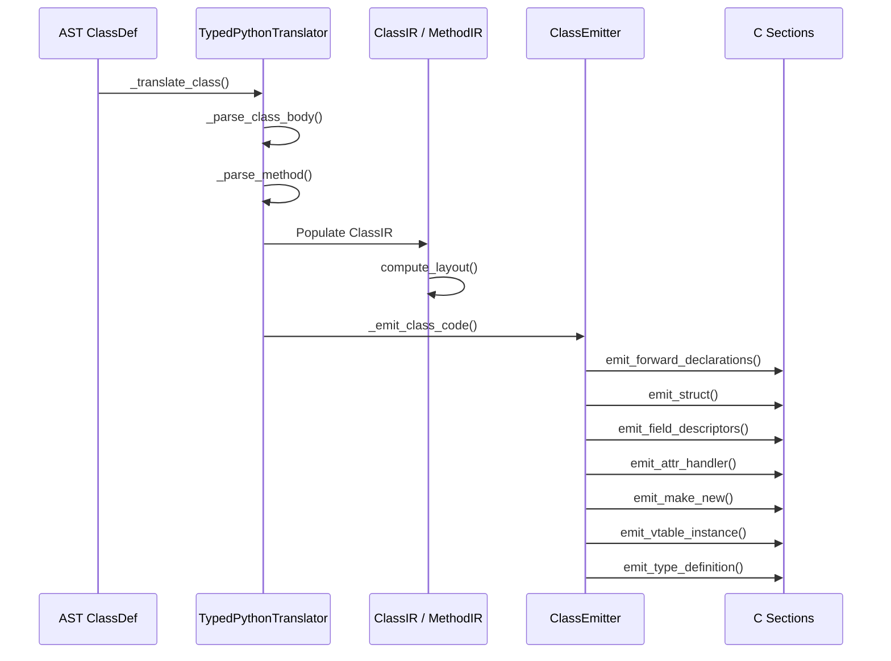
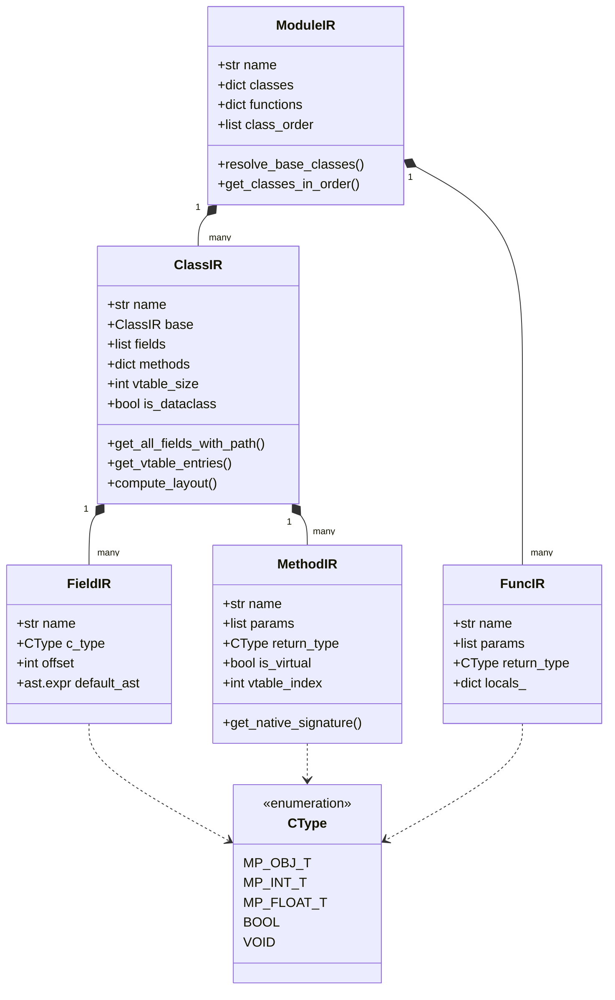

# IR Design — mypyc-micropython

This document describes the Intermediate Representation (IR) system used in the mypyc-micropython compiler. The IR provides a structured, object-oriented model of Python constructs that simplifies the generation of complex MicroPython C extension modules, particularly for classes and inheritance.

## Overview

The mypyc-micropython compiler employs a dual-track compilation strategy. While simple functions and primitive operations are translated directly from the Python Abstract Syntax Tree (AST) to C strings, more complex constructs like classes require a dedicated Intermediate Representation.

The IR layer serves as a semantic bridge, decoupling the structural analysis of Python code (parsing types, resolving inheritance, computing vtables) from the syntactical generation of MicroPython C code. This design is heavily inspired by **mypyc**, the compiler used by mypy to compile Python to CPython C extensions, but simplified to target MicroPython's leaner runtime.

## Compilation Pipelines

### High-Level Pipeline
The following diagram shows where the IR sits within the overall compilation flow:

### Dual Compilation Approach
We use different approaches based on the complexity of the Python construct:

### Class Compilation Detail
The transformation of a Python class into MicroPython C code involves several distinct stages within the IR layer:

## IR Hierarchy

The IR is implemented as a set of Python dataclasses located in `src/mypyc_micropython/ir.py`.

## Data Structures

### CType (Enum)
Defines the C-level types supported by the compiler for unboxed operations and MicroPython integration.
- **Supported Types:**
  - `MP_OBJ_T`: Standard MicroPython object pointer (`mp_obj_t`). Used for strings, lists, dicts, and custom class instances.
  - `MP_INT_T`: Unboxed integer (`mp_int_t`). Maps to `int` in Python.
  - `MP_FLOAT_T`: Unboxed float (`mp_float_t`). Maps to `float` in Python.
  - `BOOL`: Standard C `bool`. Maps to `bool` in Python.
  - `VOID`: Used specifically for functions that return `None`.
- **Key Methods:**
  - `to_c_type_str()`: Returns the C type identifier (e.g., `mp_int_t`, `bool`).
  - `to_field_type_id()`: Returns an integer ID used by the attribute handler to decide which MicroPython conversion function to call (e.g., `mp_obj_get_int` vs `mp_obj_get_float`).
  - `from_python_type(type_str)`: A static helper that parses a Python type annotation string (like `"int"` or `"list[int]"`) and returns the corresponding `CType`.

### CallTarget (Enum)
Determines the dispatch mechanism for a method call, enabling optimization based on available type information. By choosing the most specific call target, the compiler can eliminate the overhead of dynamic lookup.
- **Variants:**
  - `DIRECT`: Used when the compiler knows the exact class of the object (e.g., through a type annotation or literal creation). It generates a direct C function call to the native implementation, bypassing MicroPython's attribute lookup entirely.
  - `VTABLE`: Used for virtual methods where the specific implementation depends on the runtime type of the object. The compiler generates code to look up the function pointer in the object's vtable at a fixed offset.
  - `MP_DYNAMIC`: The slowest fallback. It uses the standard MicroPython attribute lookup mechanism (`mp_load_method` / `mp_call_method`), which is necessary when calling methods on objects whose type is not known at compile time or when calling into external Python modules.

### FieldIR (Dataclass)
Represents a single attribute defined in a class. It tracks both the Python-level semantic information and the C-level storage requirements.
- **Key Fields:**
  - `name`: The Python name of the field as it appears in the source code.
  - `py_type`: The original type annotation string (e.g., `"int"`).
  - `c_type`: The resolved `CType` used for storage in the C struct.
  - `offset`: The byte offset from the start of the object struct (calculated by `compute_layout`).
  - `has_default`: Boolean indicating if the field has a default value defined in the class or via a dataclass field.
  - `default_value`: The literal value (if any, like `0` or `None`).
  - `default_factory`: The name of a factory function (e.g., `list`) for dataclass fields that require fresh instances.
  - `default_ast`: The AST node for more complex default expressions that may need translation.
- **Purpose:** By tracking unboxed types (`int`, `float`), `FieldIR` allows the compiler to store these values directly in the C struct without boxing them into `mp_obj_t`, saving memory and CPU cycles during both storage and retrieval.

### MethodIR (Dataclass)
Represents a method within a class, including its signature and metadata for virtual dispatch.
- **Key Fields:**
  - `name`: Python method name (e.g., `calculate`).
  - `c_name`: The fully qualified, sanitized C name (e.g., `MyClass_calculate`).
  - `params`: A list of `(name, CType)` tuples representing the method parameters (excluding `self`).
  - `return_type`: The `CType` of the return value.
  - `body_ast`: The `ast.FunctionDef` node containing the method's implementation.
  - `is_virtual`: If true, this method can be overridden and will have an entry in the vtable.
  - `vtable_index`: The fixed slot index in the vtable for this method.
  - `is_special`: True for dunder methods like `__init__` or `__repr__`.
- **Key Methods:**
  - `get_native_signature(class_c_name)`: Returns a C signature that takes the specific object struct type as `self` and uses unboxed types for parameters.
  - `get_mp_wrapper_signature()`: Returns a standard MicroPython C API signature (`mp_obj_t` args) for the wrapper function exposed to Python.

### ClassIR (Dataclass)
The central node representing a Python class and its relationships.
- **Key Fields:**
  - `name`: The Python class name.
  - `base`: A reference to the parent `ClassIR` (if any).
  - `fields`: A list of `FieldIR` objects defined in *this* class.
  - `methods`: A dictionary mapping method names to `MethodIR` objects.
  - `virtual_methods`: A list of method names that participate in virtual dispatch.
  - `vtable_size`: The total number of slots in the vtable (including inherited slots).
  - `is_dataclass`: True if the class is decorated with `@dataclass`.
  - `mp_slots`: A set of strings indicating which MicroPython type slots (like `make_new`, `print`, `attr`) need to be generated.
- **Key Methods:**
  - `get_all_fields_with_path()`: Crucial for inheritance. It returns a list of all fields (own and inherited) along with the C path to access them (e.g., `super.super.age`).
  - `get_vtable_entries()`: Returns a list of all virtual methods in their correct vtable order, handling overrides by replacing parent methods with child implementations.
  - `compute_layout()`: Calculates the memory layout of the C struct, ensuring proper alignment for different C types.
  - `get_struct_name()` / `get_type_name()`: Helpers for generating consistent C identifiers like `MyClass_obj_t` and `MyClass_type`.

### DataclassInfo (Dataclass)
Stores metadata extracted from the `@dataclass` decorator.
- **Fields:** `frozen`, `eq`, `order`, `repr_`, `init`.
- **Logic Flags:** `generate_init`, `generate_repr`, `generate_eq`. These tell the `ClassEmitter` whether it needs to synthesize the C code for these methods.

### FuncIR (Dataclass)
Represents a standalone function or the context for a method's body.
- **Key Fields:**
  - `name`: Function name.
  - `locals_`: A dictionary of local variable names mapped to their `CType`. This is populated during the first pass of the body translation to ensure correct C variable declarations.

### ModuleIR (Dataclass)
The root of the IR tree for a single compilation unit.
- **Key Fields:**
  - `classes`: Map of class names to `ClassIR`.
  - `functions`: Map of function names to `FuncIR`.
  - `class_order`: A list tracking the original order of class definitions.
- **Key Methods:**
  - `resolve_base_classes()`: After all classes in a file are parsed into `ClassIR` nodes, this method links the `base_name` strings to the actual `ClassIR` objects.
  - `get_classes_in_order()`: Uses a depth-first search to return classes in topological order. If `Class B` inherits from `Class A`, `A` is guaranteed to appear before `B` in the list. This is essential for C compilers to understand the struct nesting.

## Class Emitter

The `ClassEmitter` (`src/mypyc_micropython/class_emitter.py`) takes a populated `ClassIR` and produces the various C code sections required by MicroPython.

**Key Generation Methods:**
- `emit_forward_declarations()`: Typedefs for the object struct and vtable.
- `emit_struct()`: The actual C `struct` definition, including inheritance via a `super` member.
- `emit_field_descriptors()`: Metadata table for fast attribute access.
- `emit_attr_handler()`: The `attr` slot implementation for getting/setting fields.
- `emit_make_new()`: The constructor logic (handles `mp_obj_malloc` and `__init__` calls).
- `emit_print_handler()`: Auto-generated `repr()` for dataclasses.
- `emit_binary_op_handler()`: Auto-generated `==` comparison for dataclasses.
- `emit_vtable_instance()`: Static initialization of the virtual method table.
- `emit_locals_dict()`: The dictionary containing methods exposed to MicroPython.
- `emit_type_definition()`: The `MP_DEFINE_CONST_OBJ_TYPE` macro that ties everything together.

## Benefits of the IR Layer

The IR enables several critical features that would be nearly impossible with direct AST translation:

### 1. Inheritance and Field Resolution
In Python, instance attributes are typically stored in a dictionary. In our compiled C code, they are stored in a fixed-size struct. When a class inherits from another, the child class's struct contains the parent's struct as its first member.

The IR method `get_all_fields_with_path()` resolves how to access any field in the hierarchy. For example, if `Class C` inherits from `Class B`, which inherits from `Class A`, and we want to access a field `x` defined in `A`:
- The IR calculates the path as `self->super.super.x`.
- This allows the `ClassEmitter` to generate a single, static C metadata table (`C_fields[]`) that maps Python attribute names (QSTRs) to their exact byte offsets within the nested struct, enabling extremely fast attribute access compared to dictionary lookups.

### 2. Virtual Method Dispatch (vtable)
The IR manages the complexity of method overriding. By maintaining a list of `virtual_methods` and their `vtable_index`, the IR can construct a stable vtable for each class.
- When `Class B` overrides `method_1` from `Class A`, the IR's `get_vtable_entries()` method ensures that `B`'s vtable has `B_method_1_native` at the same index where `A`'s vtable has `A_method_1_native`.
- This enables polymorphism: a C function can take a pointer to an `A_obj_t`, call `self->vtable->method_1(self)`, and the correct implementation will be executed even if the object is actually an instance of `B`.

### 3. Topological Sorting of Definitions
C requires that types be defined before they are used as members of other types. Because Python allows classes to be defined in any order (as long as they are available at runtime), the compiler cannot simply emit C code as it walks the Python file.
- `ModuleIR.get_classes_in_order()` performs a dependency analysis (topological sort) based on the `base` class references.
- This ensures that the generated C header and source files always define the base class struct before any child class struct that embeds it, preventing "unknown type" errors from the C compiler (e.g., `gcc` or `esp-idf`).

### 4. Dataclass Synthesis
The IR allows us to support `@dataclass` without requiring the user to write boilerplate methods like `__init__`, `__repr__`, or `__eq__`.
- The IR parser detects the `@dataclass` decorator and populates `DataclassInfo`.
- During the emission phase, the `ClassEmitter` checks this info and uses the IR's field list to synthesize C functions for these methods.
- These synthesized methods are then automatically registered in the MicroPython type's slots (e.g., the `print` slot for `__repr__` and the `binary_op` slot for `__eq__`).

## Implementation Details

### Memory Layout Computation (`compute_layout`)
The `compute_layout()` method in `ClassIR` is responsible for determining the physical structure of the C object in memory.
- It starts after the mandatory MicroPython header (`mp_obj_base_t` and optionally the vtable pointer).
- It iterates through each `FieldIR`.
- It assigns an `offset` to each field.
- **Alignment:** Currently, it uses a simplified alignment strategy (aligning to 8 bytes for 64-bit systems), but it is designed to be extensible for platform-specific alignment requirements (e.g., 4-byte alignment for ESP32/Xtensa).

### Attribute Dispatch (`emit_attr_handler`)
The attribute handler is one of the most performance-critical parts of the generated code.
- The `ClassEmitter` generates a C function that is called by MicroPython's runtime whenever an attribute is accessed (`obj.attr`).
- Instead of a series of `if (strcmp(attr, "name") == 0)` calls, it uses the pre-computed `C_fields[]` array.
- It loops through the descriptors, compares the `qstr` (MicroPython's interned string ID), and performs a direct memory access at `(char*)self + descriptor->offset`.
- This ensures that attribute access time is proportional to the number of fields, which is much faster than dynamic dictionary lookups.

### VTable Construction (`get_vtable_entries`)
Virtual tables enable polymorphism. The IR constructs these tables using a "top-down" approach:
1. It first copies all vtable entries from the base class.
2. It then iterates through the current class's methods.
3. If a method is found that has the same name as an entry in the copied list, it *replaces* that entry (overriding).
4. If a new virtual method is found, it is *appended* to the end of the list.
5. This ensures that the vtable layout is compatible across the inheritance hierarchy; a child class always has the same methods at the same indices as its parent.

## Summary of IR Responsibilities

| Responsibility | IR Node | Description |
|----------------|---------|-------------|
| **Semantic Parsing** | `TypedPythonTranslator` | Converting AST nodes into IR nodes and resolving types. |
| **Inheritance Mapping** | `ModuleIR` | Linking classes together and determining definition order. |
| **Layout Design** | `ClassIR` | Deciding where each field lives in the C struct. |
| **VTable Management** | `ClassIR` / `MethodIR` | Assigning stable indices to virtual methods. |
| **Dataclass Synthesis** | `DataclassInfo` | Defining the logic for auto-generated methods. |
| **Code Generation** | `ClassEmitter` | Translating the high-level IR nodes into specific C strings. |

## Future Work

- **ListIR and DictIR Extensions:**
  We plan to extend the IR to cover container operations. Currently, `list[int]` is just `MP_OBJ_T`. With `ListIR`, we could track the element type and specialize operations. For example, `my_list[0]` could be translated to a direct array access if the compiler can prove the object is a specific compiled list type, potentially bypassing the `mp_obj_subscr` lookup.

- **Transformation Passes:**
  The current IR is primarily a container for metadata. Future versions will include transformation passes that operate on the IR before code generation:
  - **Inlining:** Small methods could be inlined directly into their call sites.
  - **Dead Code Elimination:** Removing unused fields or methods identified during the IR analysis.
  - **Escape Analysis:** Identifying objects that don't "escape" a function so they can be allocated on the stack instead of the heap.

- **Multiple Module IR:**
  Currently, IR analysis is limited to a single file. Extending `ModuleIR` to handle cross-module references will allow for inheritance across different compiled modules, enabling more complex library architectures. This would require a global "registry" or a way to import IR metadata from previously compiled modules, similar to how C compilers use header files or how mypy uses stub files (.pyi).

- **Exception Handling Integration:**
  Future versions of the IR will need to represent `try`/`except` blocks and exception propagation. This will likely involve adding an `ExceptIR` node and modifying `MethodIR` to track potential exception exit points, ensuring that the generated C code correctly interfaces with MicroPython's `nlr` (non-local return) system for exception handling.

## Conclusion

The Intermediate Representation is a cornerstone of the mypyc-micropython project. It transforms the highly dynamic and flexible nature of Python classes into a rigid, predictable, and performant C structure. By following the "compile-time analysis for runtime speed" philosophy, the IR allows us to bring the power of typed Python to the most resource-constrained environments while maintaining the developer experience that Python is known for.

